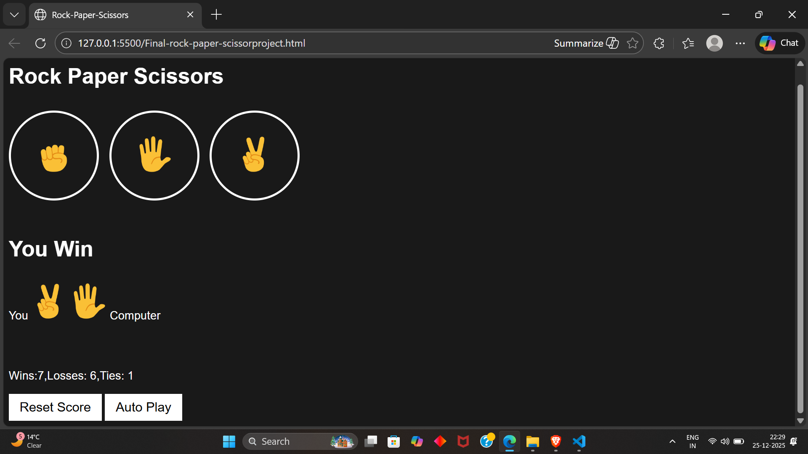

# RPS AutoPlay Game 🎮

## Description
An interactive Rock Paper Scissors web game built using HTML, CSS, and JavaScript.  
The game features persistent score tracking with localStorage, auto-play mode, keyboard shortcuts, and dynamic UI updates.

## Preview

## Features
- User vs Computer gameplay
- Persistent score using localStorage
- Auto-play mode using setInterval
- Keyboard shortcuts (R, P, S)
- Reset score functionality
- Clean and responsive UI

## Tech Stack
- HTML
- CSS
- JavaScript

## Project Structure
